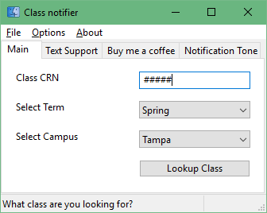
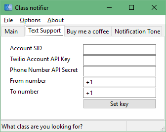

# Automated Class-Availability-Notifier

This is a Graphical Script(Gript)that Automatically sends you a notification via Sound or Text when a class you're looking for is available. Only works for the **University of South Florida**. Written in Python.

### How-to
-----
1. Enter class CRN
2. Select Term
3. Select Campus
4. Hit "Lookup Class"
5. Program will refresh the page every 60 seconds. A whistle sound will play if the class has seats open. A low beep will play to let you know that it found your class but no seats are open. I suggest just leaving the application open in the background as it polls for your class.
  
### Setting up text messaging
-----
  > Text messaging will require you to have a Twilio account, it's a text messaging api. 
  > Register a free account, get your Account SID and API key. Then Register a new number, after you register a new number click on it and add your personal phone number to the list of numbers your twilio "From Number" can send messages too.
 
 
 
  Then go to tools > API keys > Create New API Key > Name it and Create API Key > Copy down your phone number API secret as **you only get to see it once** > Paste your Account SID, API key, and Secret key into the app along with your from number and to number **no dashes**
  
  To not waste your text messages the notifier will only send the text once and only once when your class is available. Restart the application to reset text messaging. Better functionality will be added later.
  
### Installing without Python
-----
1. [Click Here](https://github.com/kevin2107/Class-Availability-Notifier/releases/download/0.9.7/latest.zip) to download the latest exe release
2. Launch usfcheck.exe in the same folder as chromedriver.exe and enjoy!
